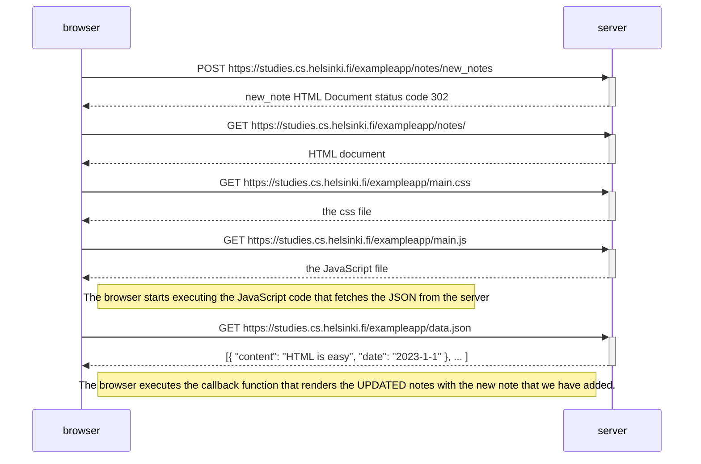

```mermaid
sequenceDiagram
  participant browser as browser
  participant server as server

  browser ->>+ server: POST https://studies.cs.helsinki.fi/exampleapp/notes/new_notes
  server -->>- browser: new_note HTML Document status code 302
  browser->>server: GET https://studies.cs.helsinki.fi/exampleapp/notes/
    activate server
    server-->>browser: HTML document
    deactivate server
  browser ->>+ server: GET https://studies.cs.helsinki.fi/exampleapp/main.css
  server -->>- browser: the css file
  browser ->>+ server: GET https://studies.cs.helsinki.fi/exampleapp/main.js
  server -->>- browser: the JavaScript file
  Note right of browser: The browser starts executing the JavaScript code that fetches the JSON from the server
  browser ->>+ server: GET https://studies.cs.helsinki.fi/exampleapp/data.json
  server -->>- browser: [{ "content": "HTML is easy", "date": "2023-1-1" }, ... ]
  Note right of browser: The browser executes the callback function that renders the UPDATED notes with the new note that we have added.

```